Untitled
================
Charisa Geyer
2025-06-12

# Purpose: Practicing using ggplot2 before I attempt the datsci prac project!

I am learning how to use the RStudio add-in: GGplotAssist

# Cleaning the environment

``` r
rm(list = ls()) # Clean your environment:
gc() # garbage collection - It can be useful to call gc after a large object has been removed, as this may prompt R to return memory to the operating system.
```

    ##           used (Mb) gc trigger (Mb) max used (Mb)
    ## Ncells  548665 29.4    1224424 65.4   686380 36.7
    ## Vcells 1043137  8.0    8388608 64.0  1876266 14.4

``` r
library(tidyverse)
```

    ## ── Attaching core tidyverse packages ──────────────────────── tidyverse 2.0.0 ──
    ## ✔ dplyr     1.1.4     ✔ readr     2.1.5
    ## ✔ forcats   1.0.0     ✔ stringr   1.5.1
    ## ✔ ggplot2   3.5.1     ✔ tibble    3.3.0
    ## ✔ lubridate 1.9.4     ✔ tidyr     1.3.1
    ## ✔ purrr     1.0.4     
    ## ── Conflicts ────────────────────────────────────────── tidyverse_conflicts() ──
    ## ✖ dplyr::filter() masks stats::filter()
    ## ✖ dplyr::lag()    masks stats::lag()
    ## ℹ Use the conflicted package (<http://conflicted.r-lib.org/>) to force all conflicts to become errors

``` r
list.files('code/', full.names = T, recursive = T) %>% .[grepl('.R', .)] %>% as.list() %>% walk(~source(.))
```

# Installing the prerequisite and add-in package

``` r
#install.packages("devtools")
devtools::install_github("cardiomoon/editData")
```

    ## Skipping install of 'editData' from a github remote, the SHA1 (5c539ac7) has not changed since last install.
    ##   Use `force = TRUE` to force installation

``` r
#install.packages("devtools")
devtools::install_github("cardiomoon/ggplotAssist")
```

    ## Skipping install of 'ggplotAssist' from a github remote, the SHA1 (1db61ade) has not changed since last install.
    ##   Use `force = TRUE` to force installation

# Loading the dataset to start with

``` r
library(ggplot2)
library(ggplotAssist)
data_use <- fmxdat::Indexes
fmxdat::Indexes_Labs
```

    ## # A tibble: 9 × 2
    ##   Country Label
    ##   <chr>   <chr>
    ## 1 brz     Brics
    ## 2 chn     Brics
    ## 3 zar     Brics
    ## 4 ind     Brics
    ## 5 rus     Brics
    ## 6 mex     Mint 
    ## 7 tur     Mint 
    ## 8 hun     HEGP 
    ## 9 egt     HEGP

``` r
joined_data_use <- left_join(fmxdat::Indexes %>% gather(Country, TRI, -Date), 
fmxdat::Indexes_Labs,
by = "Country") %>% arrange(Date)

# highlight the dataframe/tibble and click on AddIns -> GGplotAssist
```

# Now let’s follow the tutorial given in class

## Tidy up the data

``` r
pacman::p_load(tidyverse)

plot_df <- 
left_join(
fmxdat::Indexes %>% gather(Country, TRI, -Date),
fmxdat::Indexes_Labs,
by = "Country"
) %>% mutate(Label = coalesce(Label, "Other")) %>% arrange(Date)
  
print(plot_df)
```

    ## # A tibble: 16,590 × 4
    ##    Date       Country    TRI Label
    ##    <date>     <chr>    <dbl> <chr>
    ##  1 2000-01-14 brz     1420.  Brics
    ##  2 2000-01-14 chl       NA   Other
    ##  3 2000-01-14 chn       36.7 Brics
    ##  4 2000-01-14 col      105.  Other
    ##  5 2000-01-14 cze       91.7 Other
    ##  6 2000-01-14 egt      352.  HEGP 
    ##  7 2000-01-14 grc     1215.  Other
    ##  8 2000-01-14 hun      369.  HEGP 
    ##  9 2000-01-14 ind      175.  Brics
    ## 10 2000-01-14 ino      280.  Other
    ## # ℹ 16,580 more rows

## Plot all Brics countries together in one plot

``` r
dfPlotData <- plot_df %>% filter(Label == "Brics")
g <- 
  dfPlotData %>% 
  
  # Initialize the canvas:
  ggplot() +
  
  # Now add the aesthetics:
  geom_line(aes(x = Date, y = TRI, color = Country), alpha = 0.8, size = 1) 
```

    ## Warning: Using `size` aesthetic for lines was deprecated in ggplot2 3.4.0.
    ## ℹ Please use `linewidth` instead.
    ## This warning is displayed once every 8 hours.
    ## Call `lifecycle::last_lifecycle_warnings()` to see where this warning was
    ## generated.

``` r
# Notice that I used alpha to adjust the line opacity (useful when having overlapping lines e.g.)

print(g)
```

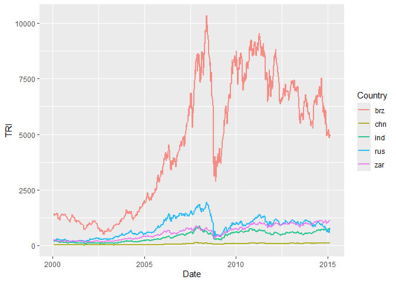<!-- -->

``` r
# Create smaller dataframe with only the Brics countries
dfPlotData <- plot_df %>% filter(Label == "Brics")

# Create the plot list
g <- dfPlotData %>% 
    ggplot() + # Create the canvas
    geom_line(aes(x = Date, y = TRI, color = Country), alpha = 0.8, size = 1)
print(g)
```

<!-- -->

Now bring g down (the plot) and add a couple of things:

``` r
g <- 
  g + 
  theme_bw() + 
  theme( legend.position = "bottom") + 
  labs(x = "", y = "Prices",
       title = "TRI of Brics Countries", 
       subtitle = "Total Return Index using net dividends reinvested",
       caption = "Note:\nBloomberg data used")
  
g
```

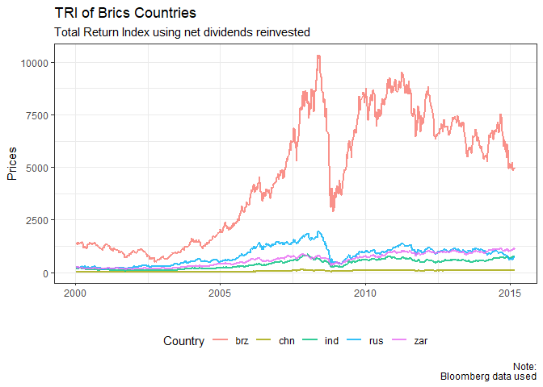<!-- -->

## Breaking up each line into its own plot

``` r
g <- # redefine g now!
g +
  facet_wrap(~Country)

g
```

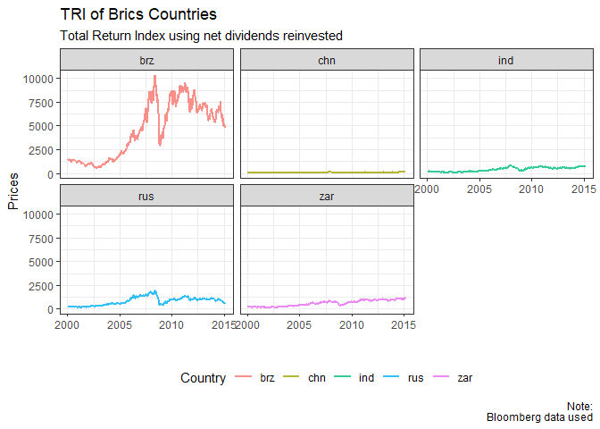<!-- -->

Almost there… let’s scale the axes to be free for each y, and also
change the colours a bit using ggthemes:

``` r
pacman::p_load(ggthemes)
g <- 
g + 
  facet_wrap(~Country, scales = "free_y") + 
  ggthemes::scale_color_wsj()

g
```

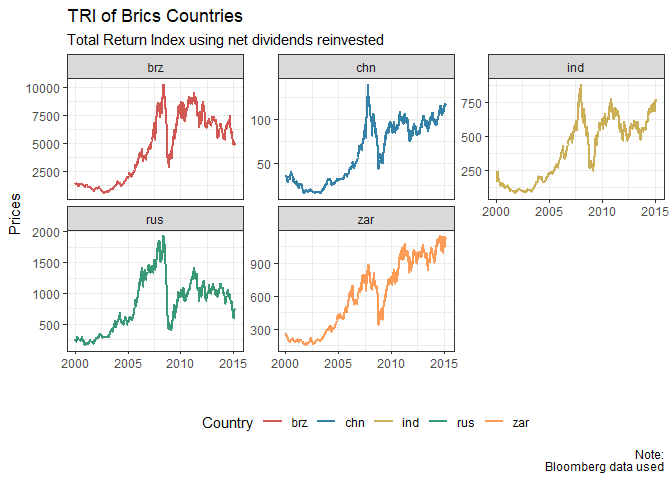<!-- -->

Another theme library to consider is ggsci. \* Here’s the gallery, and
you can use this as shown here.

Let’s use e.g. npg as color, and also change the thickness of the lines
(see size parameter…)

``` r
pacman::p_load("ggsci")
g + scale_color_npg()
```

    ## Scale for colour is already present.
    ## Adding another scale for colour, which will replace the existing scale.

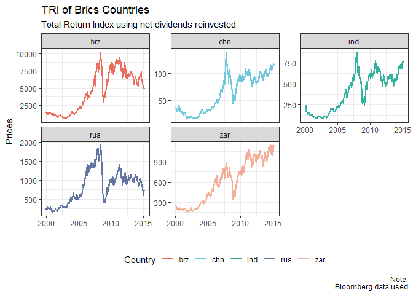<!-- --> Can do a
deeper analysis of a subset of dates etc, since the “figures are alive”

``` r
g %+% subset(dfPlotData, Date > as.Date("2009-01-31")) + labs(title = "Post-Crisis TRI")
```

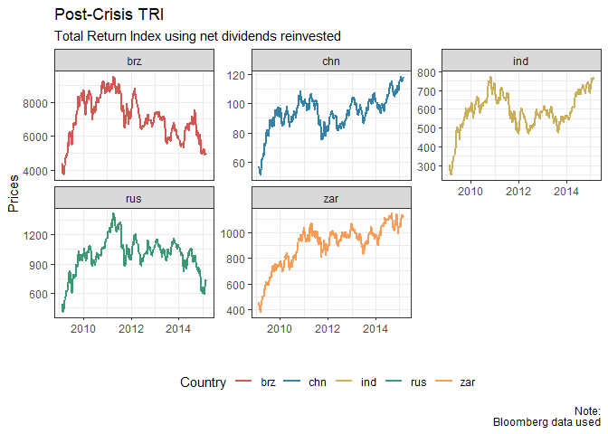<!-- -->

``` r
g %+% subset(dfPlotData, Date < as.Date("2009-01-31")) + labs(title = "Pre-Crisis TRI")
```

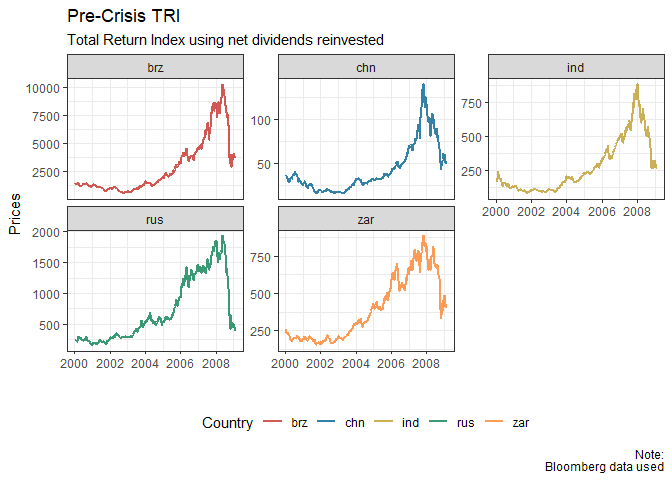<!-- --> You could
also retrieve the data of a ggplot object simply as:

``` r
Plot_Data_Recovered <- g$data
```

You could also add another dataframe and some labels to your plot as:

``` r
pacman::p_load(lubridate)
Another_df <- fmxdat::findata %>% gather(Stocks, Px, -Date) %>% filter(Stocks == "JSE.SLM.Close")

g + 
  geom_line(data = Another_df, aes(Date, Px, color = Stocks), colour = "steelblue", alpha = 0.3) + 
  geom_label(data = Another_df %>% filter(Date == last(Date)), aes(Date, Px, label = Stocks), size = 3, alpha = 0.1) + 
  
  geom_label(data = dfPlotData %>% filter(Date == last(Date)), aes(Date, TRI, label = Country), size = 3, alpha = 0.1) 
```

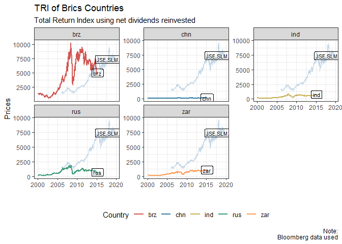<!-- -->

# Saving your plots

``` r
rmsfuns::build_path( paste0( getwd(), "Figures"))
```

    ## [1] "C:/Users/Charisa/OneDrive - Stellenbosch University/Documents/2025/Semester 1/Data_Science/Practicals/Revision/GGplot_revisionFigures"

``` r
ggsave(
  filename = "Figures/Plot.png", # here you can also give your figure a name!
  plot = g, width = 6, height = 6, device = "png")
```

# Other plots

\#Density plots

``` r
plot_data <- 
  dfPlotData %>% 
  
  group_by(Country) %>% 
  
  mutate(Return = TRI/lag(TRI)-1) %>% ungroup()

gdens <- 
  plot_data %>% 
  ggplot() + 
  geom_density(aes( x = Return, fill = Country )) #Note - here we set the fill to be given by ‘Country’. Fill works similarly to colour, where the latter would’ve simply coloured the line, not the area under the curve.

gdens
```

    ## Warning: Removed 5 rows containing non-finite outside the scale range
    ## (`stat_density()`).

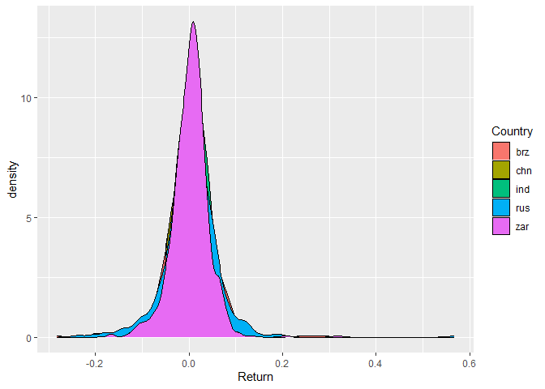<!-- -->

### Adjust opacitity

### Colour the lines

``` r
gdens <- 
gdens +
  
  geom_density(aes( x = Return, fill = Country , colour = Country), alpha = 0.2, size = 1.25) + 
  
  ggthemes::theme_economist_white()

gdens
```

    ## Warning: Removed 5 rows containing non-finite outside the scale range
    ## (`stat_density()`).
    ## Removed 5 rows containing non-finite outside the scale range
    ## (`stat_density()`).

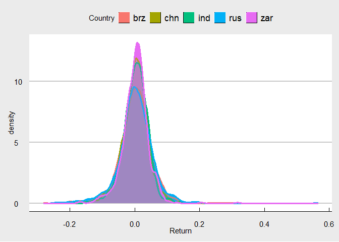<!-- -->

Subsetting to look only at the deep left-tail (say returns below 10%) is
also super easy:

Notice that subset requires a logical operator (i.e. must give TRUE /
FALSE). The following won’t work therefore as it is a wrangle, not a
logical operator:

``` r
#gdens %+% subset(plot_data, ifelse(Return < -0.1, -0.1, Return) ) + labs(title = "Left tail plot")
```

So, let’s bring the tails in a bit to not skew the graph as much. This
requires a re-wrangling, not simply a subsetting:

Let’s trim our returns to be between 5% - 95% quantiles of returns only:

# Winzorising

``` r
# Winzorising to be between 5% and 95% can be done as follows:

new_plot_data <-
    plot_data %>% 
    filter(!is.na(Return)) %>% group_by(Country) %>% 
    mutate(q05 = quantile(Return, na.rm=T, probs=0.05), q95 = quantile(Return, na.rm=T, probs = 0.95), Return = ifelse(Return >= q95, q95, ifelse(Return <= q05, q05, Return))) %>% 
    
    select(-starts_with("q")) %>% 
    ungroup()

plot_data <- 
  plot_data %>% 
  
  filter(!is.na(Return)) %>% group_by(Country) %>% 
  
  mutate(q05 = quantile(Return, na.rm=T, probs = 0.05), q95 = quantile(Return, na.rm=T, probs = 0.95), Return = ifelse(Return >= q95, q95, ifelse(Return <= q05, q05, Return))) %>% 
  
  select(-starts_with("q")) %>% ungroup()

gdens <- 
  ggplot(plot_data) +
  
  geom_density(aes( x = Return, fill = Country , colour = Country), alpha = 0.2, size = 1.25) + 
  
  ggthemes::theme_economist_white() + 
  
  labs(y = "Density (winsorized)", x = "Return", title = "Return density plot") + 
  
  theme(legend.position = "bottom")

gdens
```

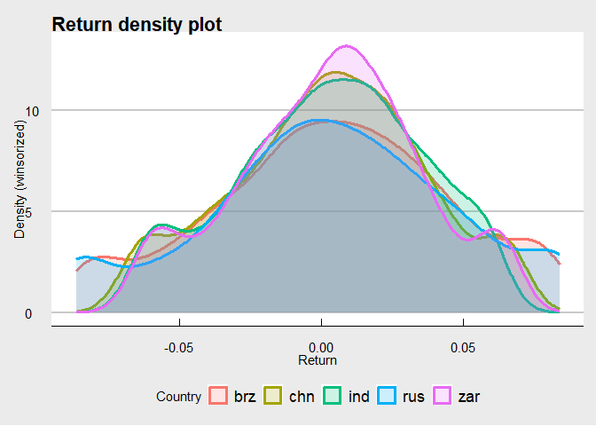<!-- --> \# Figures
in functions Of course! Ideally you should specify templates for your
functions and source it like you would any other comment.

E.g., in the following code chunk I introduce you to boxplotting and
jitter plotting combined in ggplot. I do this in a function, where I:

Make my function safe to illustrate an intentional error with a clear
message to solve it

Show you how a figure’s design can be flexibly incorporated into a
function:

``` r
pacman::p_load(purrr)

Jitter_Boxplot <- function(data_frame, Title, Subtitle, Caption, Xlab, Ylab, Alpha_Set = 0.5) {

  # Dataframe should be tidy, and be of the form: 
      # date  | Ticker  |   Identifier  |  Return  

  if( !"Identifyer" %in% names(data_frame) ) stop("\n\nERROR:::::>Please provide valid Identifier column!\n\n")
  if( !"Date" %in% names(data_frame) ) stop("Please provide valid Date column ")
  if( class(data_frame$Date) != "Date" ) stop("Date column not of class Date ")
  
g1 <-   
ggplot(data_frame) + 
  
  geom_boxplot(aes(x = Identifier, y = Return, fill = Country), alpha = Alpha_Set) + 
  
  geom_jitter(aes(x = Identifier, y = Return, color = Country, alpha = Alpha_Set)) + 
  
    theme_bw() + 
  
  guides(color = FALSE, fill = FALSE, alpha = FALSE) +
  # Add titles:
  labs(title = Title, 
       subtitle = Subtitle,
       caption = Caption,
       x = Xlab, y = Ylab) + 
  
  scale_color_npg() + # Now we use fill...
  
  scale_fill_npg() # Now we use fill...

g1  

}

SafeJitter <- purrr::safely(Jitter_Boxplot)
# Let's first break it to see the error produced:
Result <-SafeJitter(data_frame = plot_data, 
               Title = "BRICS Return Histograms", 
               Subtitle = "Transparency is key", 
               Caption = "Data was downloaded from Bloomberg", 
               Xlab = "", Ylab = "Distribution",
               Alpha_Set = 0.4)

  print(Result$error)
```

    ## <simpleError in .f(...): 
    ## 
    ## ERROR:::::>Please provide valid Identifier column!
    ## 
    ## >
